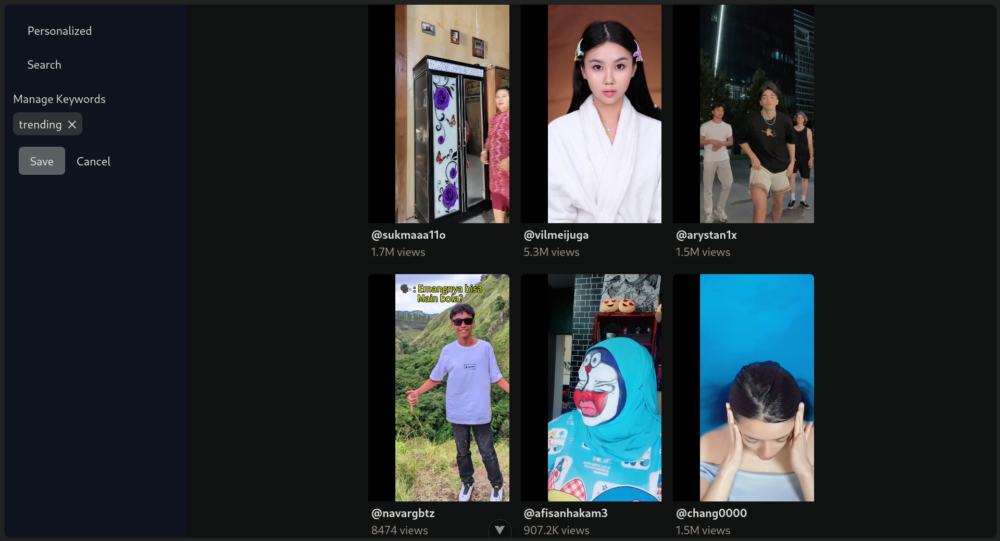
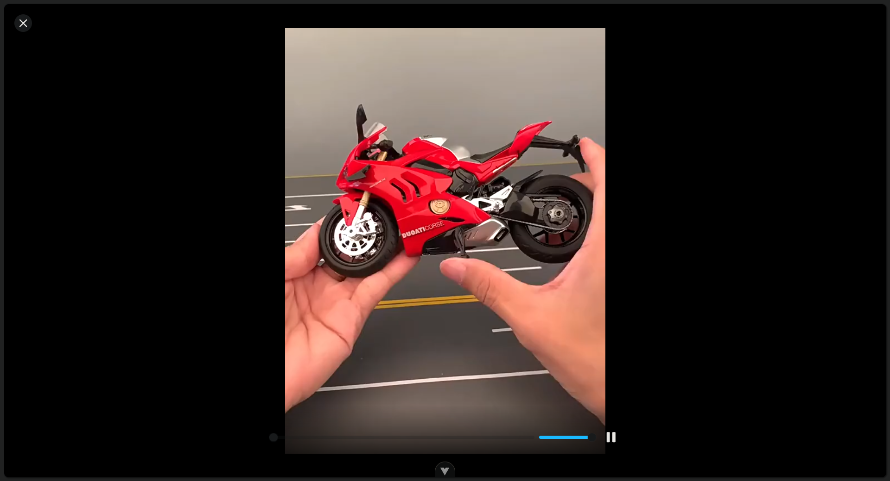
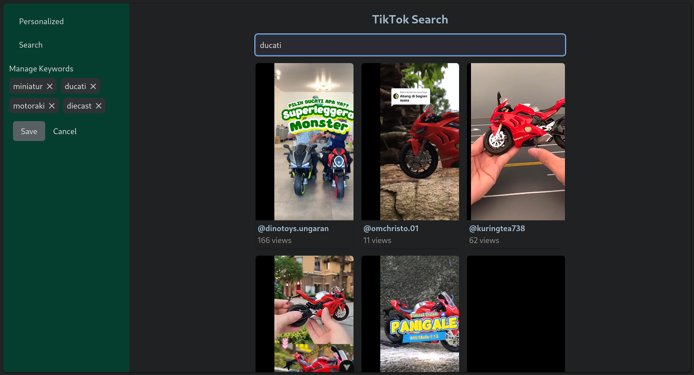

# VueGouette: TikTok Video Scraper

A full-stack application for scraping TikTok videos, built using Go for the backend and Vue.js for the frontend.

## Table of Contents

- [The Apps](#the-apps)
- [Libraries Used](#libraries-used)
- [Library Breakdown](#library-breakdown)
- [Running the Project](#running-the-project)
  - [Using Docker](#using-docker)
  - [Manually](#manually)

## The Apps

### Here are the screenshots of the apps

| Home Page (Personalized) |
|:--:|
|  |

| Infinite Scrolling |
|:--:|
|  |

| Fullscreen Video |
|:--:|
|  |

### Using different themes / color palettes

| Default (Search Page) |
|:--:|
|  |

| Senti |
|:--:|
|  |

| CV |
|:--:|
|  |

## Libraries Used

### Backend Libraries
- [Echo](https://github.com/labstack/echo): A high-performance, minimalist web framework for Go.
- [GORM](https://gorm.io/index.html): An ORM library for Golang that provides an easy way to interact with databases.
- [Go Redis](https://github.com/go-redis/redis): A Redis client for Go, allowing easy interaction with Redis.
- [JWT](https://github.com/golang-jwt/jwt-go): A Go implementation of JSON Web Tokens for secure API authentication.
- [Chromedp](https://github.com/chromedp/chromedp): A Go library for driving headless Chrome or Chromium browsers.


### Frontend Libraries
- [Vue.js](https://vuejs.org/): A progressive JavaScript framework for building user interfaces.
- [Vue Router](https://router.vuejs.org/): The official router for Vue.js that enables navigation between different components.
- [Axios](https://axios-http.com/): A promise-based HTTP client for the browser and Node.js.
- [Plyr Vue](https://github.com/sampotts/plyr): A simple, customizable HTML5 media player with a Vue.js wrapper.
- [Tailwind CSS](https://tailwindcss.com/): A utility-first CSS framework for building modern user interfaces.
- [Tanstack Query](https://tanstack.com/query/): Powerful asynchronous state management for TS/JS, React, Solid, Vue, Svelte and Angular


## Running the Project

### Using Docker

1. **Clone the Repository**:
  ```bash
  git clone https://github.com/fadilmuh22/vuegouette.git
  cd vuegouette
  ```
2. **Build the Docker Image**:
  ```bash
  docker-compose build
  ```
3. **Run the Docker Container**:
  ```bash
  docker-compose up
  ```

### Manually
1. **Clone the Repository**:
  ```bash
  git clone https://github.com/fadilmuh22/vuegouette.git
  cd vuegouette
  ```
2. **Start the Backend**:
  ```bash
  air -c .air.toml
  ```
3. **Start the Frontend**:
  ```bash
  cd web
  npm install
  npm run dev
  ```


## Access the Application
- **Backend**: http://localhost/api
- **Frontend**: http://localhost


## Scraping with Chromedp
The application uses the Chromedp library to scrape TikTok videos. Chromedp enables programmatic control of headless Chrome, allowing us to navigate web pages and extract information. The scraping process includes:
- Initializing a Chromedp context for each user, ensuring that we maintain state across requests.
- Navigating to the TikTok search page based on user-defined keywords.
- Extracting video data from the page, including video URLs, user avatars, video titles, and tags.


## State Management for Users and Keywords
To maintain state for each user and keyword combination, the application employs a concurrency-safe map (userContexts) that associates user IDs with their respective Chromedp contexts. Each context has an expiration policy to free up resources after a specified period of inactivity. This allows multiple users to scrape TikTok independently without interference.


## Personalized Video Recommendations
The application provides personalized video recommendations based on user-defined keywords. Users will automaticall update a new keyword when they watch a video add it to their profile, which the application uses to scrape TikTok videos. The application then displays videos that match the user's keywords, allowing users to discover content that aligns with their interests.


## Switching Themes in Tailwind CSS
The Tailwind CSS configuration supports multiple themes through a custom color map. The colorsMap object defines color palettes for different themes (e.g., default, senti, and cv). You can switch themes by changing the colors used in your components based on the desired theme. To use a different theme, simply update the theme property in your component or apply classes according to your color configuration in tailwind.config.js.


## Navigating Video in Fullscreen Mode
The application uses the Plyr Vue media player to display TikTok videos. Plyr Vue provides a simple, customizable HTML5 media player that supports full-screen mode. When clicking a video thumbnail, the application opens the video in full-screen mode, allowing users to watch videos in a larger format. The user can utilizes the shortcuts for navigating such as the arrow keys and page up & down to move between videos and escape for exiting fullscreen mode. Mobile users can swipe up or down to navigate between videos.


## License
This project is licensed under the MIT License - see the [LICENSE](LICENSE) file for details.
